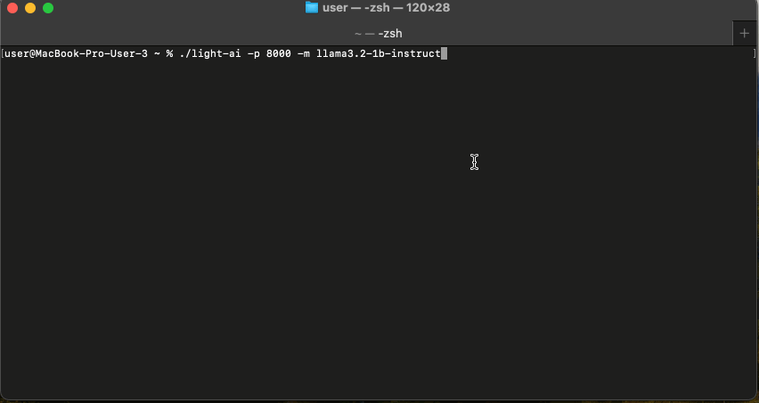

Light AI
========
Easy to use single-file executable to run LLMs locally on your machine



## Getting Started

- **Download the right Light AI server for your operating system.**

1. Run `./light-ai` (`./light-ai.exe` for Windows) from the command line.
2. Open Swagger (`http://0.0.0.0:8000/swagger`) and pick `id` of one of the available models: `GET /v1/models`.
3. Restart the server with the model `id` in params (For example: `./light-ai -m llama3.2-1b-instruct`).

That's it! Your personal AI server is ready for usage. Try `POST /v1/ask` and `POST /v1/completion` to check.

## Download

<table>
  <tr style="text-align:center">
    <td style="text-align:center"><b>MacOS Silicon</b></td>
    <td style="text-align:center">
      <a href='https://github.com/explicit-logic/light-ai/releases/download/v0.0.1/light-ai-mac-silicon' download="light-ai">
        <b>light-ai</b>
      </a>
    </td>
  </tr>
  <tr style="text-align:center">
    <td style="text-align:center"><b>MacOS Intel</b></td>
    <td style="text-align:center">
      <a href='https://github.com/explicit-logic/light-ai/releases/download/v0.0.1/light-ai-mac-intel' download="light-ai">
        <b>light-ai</b>
      </a>
    </td>
  </tr>
  <tr style="text-align:center">
    <td style="text-align:center"><b>Linux</b></td>
    <td style="text-align:center">
      <a href='https://github.com/explicit-logic/light-ai/releases/download/v0.0.1/light-ai-linux' download="light-ai">
        <b>light-ai</b>
      </a>
    </td>
  </tr>
   <tr style="text-align:center">
    <td style="text-align:center"><b>Windows</b></td>
    <td style="text-align:center">
      <a href='https://github.com/explicit-logic/light-ai/releases/download/v0.0.1/light-ai-win.exe' download="light-ai.exe">
        <b>light-ai.exe</b>
      </a>
    </td>
  </tr>
</table>

## Usage

```sh
./light-ai -p 8000 -m llama3.2-1b-instruct
```

| Argument | Explanation |
| -------- | ----------- |
| `-p, --port` | Port to listen on (__Optional__) |
| `-m, --model` | Model name (__Optional__) |

## API Endpoints

### POST `/v1/ask`: Get a quick reply for a given `prompt`

*Options:*

`prompt`: Provide the prompt to get a reply (__Required__)

`model`: Model name (__Optional__)

`grammar`: Set grammar for grammar-based sampling (__Optional__)

`schema`: JSON response with a schema (__Optional__)


For Example:

```sh
curl http://0.0.0.0:8000/v1/ask --header 'Content-Type: application/json' --data '{"prompt": "Is an apple more expensive than a banana?"}'
```

### POST `/v1/completion`: Given a `prompt`, it returns the predicted completion.

*Options:*

`prompt`: Provide the prompt for this completion as a string (__Required__)

`model`: Model name (__Optional__)

For Example:

```sh
curl http://0.0.0.0:8000/v1/completion --header 'Content-Type: application/json' --data '{"prompt": "Here is a list of sweet fruits:"}'
```

### GET `/v1/models`: List of models

### POST `/v1/models/pull`: Pull a model

*Options:*

`model`: Model name (__Required__)

## Acknowledgements
* Bun: [oven-sh/bun](https://github.com/oven-sh/bun)
* node-llama-cpp: [withcatai/node-llama-cpp](https://github.com/withcatai/node-llama-cpp)
